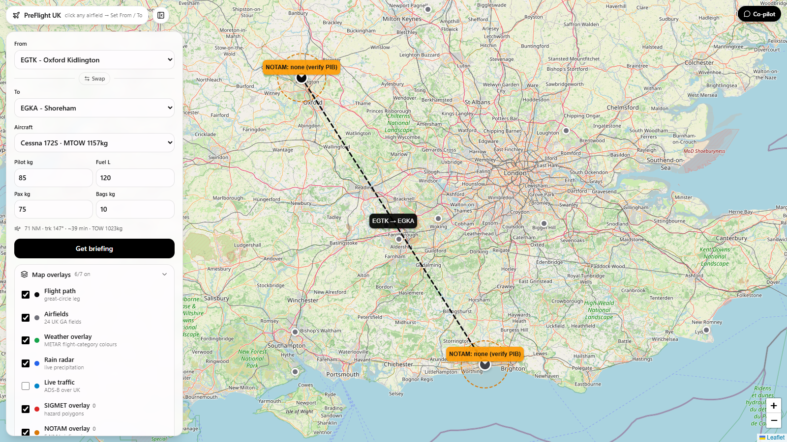
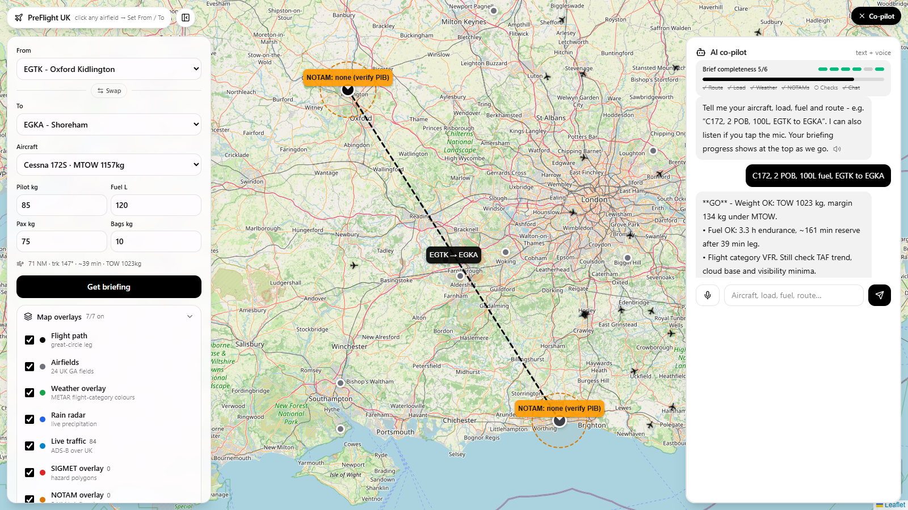

# PreFlight UK

All-in-one pre-flight briefing for UK general aviation pilots. Plan a route on an interactive map, pull live weather, NOTAMs, SIGMETs and traffic overlays, get a GO / CAUTION / NO-GO brief with weight-and-balance, and talk it through with a built-in AI co-pilot.

<p align="center">
  
</p>

## Why I built this

I flew a plane for the first time last month with Cambridge Gliding Centre. What struck me before we even got airborne was the sheer number of checks a flight needs, and how scattered the answers were: weather on one site, NOTAMs on another, airfield information somewhere else entirely. PreFlight UK pulls all of that into one calm, minimal interface, with a built-in co-pilot so the go / no-go decision is easy to talk through.

## Tour

### 1. Interactive briefing map

Pick any of 24 UK GA airfields straight from the map, or from the From / To panel. The great-circle leg, distance, track and still-air time update live.

<p align="center">
  
</p>

### 2. One-click briefing

Hit Get briefing for live METARs and TAFs, UK SIGMETs, per-airfield NOTAMs, plus weight-and-balance, fuel reserve and crosswind checks against your aircraft limits. The result is a plain GO / CAUTION / NO-GO verdict with reasons.

<p align="center">
  
</p>

### 3. Map overlays checklist

Every information layer is a checkbox: flight path, airfields, weather colours, rain radar, live ADS-B traffic, SIGMET polygons and NOTAM briefing rings. Tick a box and the overlay draws straight onto the map.

<p align="center">
  
</p>

### 4. AI co-pilot with briefing progress

Type or speak your aircraft, load, fuel and route. The co-pilot re-briefs weight, fuel and wind from the live data, reads answers aloud, and tracks briefing completeness (route, load, weather, NOTAMs, checks, chat) on a progress bar until the brief is complete.

<p align="center">
  
</p>

## Quick start

Requirements: Node.js 18+ and npm.

```bash
npm install
npm run dev
```

Open http://localhost:3000.

Optional API keys (copy `.env.example` to `.env`):

| Variable | Used for | Required |
| --- | --- | --- |
| `CHECKWX_API_KEY` | Open NOTAMs (free tier at checkwx.com) | No - without it the app links out to the official NATS PIB |
| `OPENAI_API_KEY` | Smarter co-pilot replies | No - a built-in rules briefing is used otherwise |

Useful scripts:

```bash
npm run dev          # local development
npm run build        # production build
npm run start        # serve the production build
npm run lint         # eslint
npm run screenshots  # re-capture the docs/screenshots tour (needs the app running)
```

## Data sources

| Layer | Source | Notes |
| --- | --- | --- |
| METAR / TAF / SIGMET | aviationweather.gov API | Free, no key |
| En-route model data | Open-Meteo (UKMO seamless) | Free, no key |
| NOTAMs | CheckWX API (optional key) | Falls back to official NATS links |
| Live traffic | OpenSky Network | Free, rate-limited, cached 60 s |
| Rain radar | RainViewer API | Free for personal / educational use |
| Base map | OpenStreetMap | - |

Important: this is a planning aid, not an official briefing. Always verify with an official NATS PIB and the Met Office MAVIS service before flight.

## Project structure

```text
src/
  app/
    page.tsx              # map-first briefing dashboard
    api/
      metar/route.ts      # METAR proxy (aviationweather.gov)
      taf/route.ts        # TAF proxy
      sigmet/route.ts     # UK-filtered SIGMETs with polygons
      notam/route.ts      # NOTAMs via CheckWX, official links fallback
      enroute/route.ts    # Open-Meteo UKMO en-route weather
      traffic/route.ts    # OpenSky ADS-B over the UK
      chat/route.ts       # co-pilot (rules briefing + optional OpenAI)
  components/
    RouteMap.tsx          # Leaflet map, overlays, airfield markers
    LayersControl.tsx     # overlay checklist panel
    TrafficLayer.tsx      # live traffic markers
    ChatPanel.tsx         # co-pilot chat, voice I/O, progress bar
  lib/
    airfields.ts          # 24 UK GA airfields
    aircraft.ts           # GA aircraft profiles and limits
    aviation.ts           # distance, bearing, crosswind helpers
    briefing.ts           # GO / CAUTION / NO-GO rules engine
docs/
  screenshots/            # README tour images + capture script
```

## Contributing

Issues and pull requests are welcome. Keep the UI minimal, keep every overlay backed by a real data source, and never invent METARs or NOTAMs.

Contributors: [ATEMtechuk](https://github.com/ATEMtechuk)

## License

MIT - see [LICENSE](LICENSE).
